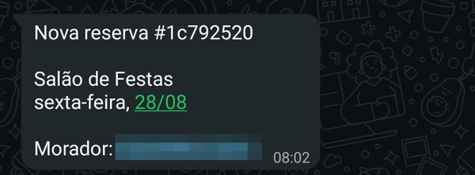
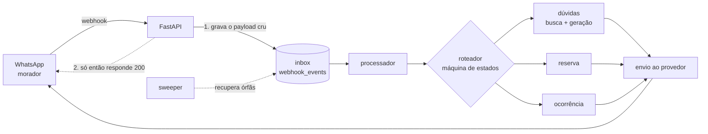

# Assistente para Condomínios

**Atendimento por WhatsApp com IA para condomínios.** O morador tira dúvida do regimento,
reserva a área comum e abre ocorrência sozinho, a qualquer hora, sem instalar nada. O síndico
só é acionado quando alguém precisa decidir de fato.

Python assíncrono · FastAPI · PostgreSQL + pgvector · OpenAI · integração com WhatsApp por provedor externo

<table>
  <tr>
    <td width="33%" valign="top">
      
    </td>
    <td width="33%" valign="top">
      
    </td>
    <td width="33%" valign="top">
      
    </td>
  </tr>
  <tr>
    <td valign="top"><sub><b>Responde citando o artigo.</b> A pergunta chega solta; a resposta aponta onde está escrito.</sub></td>
    <td valign="top"><sub><b>Lembra do contexto — e admite o limite.</b> "E gato, pode?" não repete o assunto. O que o regimento não cobre vira encaminhamento, nunca invenção.</sub></td>
    <td valign="top"><sub><b>Reserva fechada na conversa.</b> Escolhe, confirma, e o síndico é avisado.</sub></td>
  </tr>
</table>

<p align="center">
  
  <br>
  <sub>E do outro lado: o aviso no celular do síndico. <b>O telefone do morador está borrado aqui</b> — no sistema ele chega inteiro, que é justamente o ponto.</sub>
</p>


---

## O problema

Síndico de condomínio pequeno é voluntário e atende no WhatsApp pessoal. A maior parte do que
chega é pergunta cuja resposta já está escrita no regimento — *pode cachorro?*, *até que horas
pode obra?*, *o salão está livre no dia 12?* — e cada uma custa uma interrupção. O que sobra
depois de filtrar isso é pouco, mas é o que realmente precisa de um humano.

Este projeto faz esse filtro. Não substitui o síndico: devolve o tempo dele.

## O que o morador faz

O atendimento é um menu numerado — sem linguagem natural para navegar, porque número não
depende de acento, de correção ortográfica nem de intenção bem escrita.

| Opção | O que acontece |
|---|---|
| **1 · Dúvidas** | Pergunta livre sobre o regimento. A resposta sai da busca semântica no documento do próprio condomínio, sempre citando o artigo de origem. |
| **2 · Reservar** | Assistente passo a passo: área, dia livre, confirmação. A reserva é gravada na hora e o síndico é avisado. |
| **3 · Ocorrência** | Registro de problema com descrição e foto opcional. |
| **5 · Minhas reservas** | Lista as reservas futuras e cancela a escolhida — o síndico é avisado do cancelamento como foi do pedido. |
| **9 · Trocar condomínio** | O mesmo número pode atender a mais de um condomínio. |

Multi-tenant: cada condomínio tem seu próprio regimento, suas áreas e seu síndico — e o
isolamento entre eles é verificado por teste, não por convenção.

## Como funciona



O ponto do desenho está na ordem dos passos 1 e 2: **o `200 OK` só sai depois que a mensagem
está commitada no banco**. Enquanto o webhook não confirmar, a mensagem é problema do
provedor; depois que confirmou, é problema nosso — e nesse instante ela já está durável. Um
crash no meio do processamento não perde nada: a linha continua `pendente` e o `sweeper` a
recolhe no ciclo seguinte.

Do outro lado, o formato do provedor não entra no sistema: a borda converte o JSON recebido em
um `IncomingMessage` tipado, e nada além do adapter sabe qual provedor está do outro lado. Trocar de
provedor — para a API oficial do WhatsApp, por exemplo — é reescrever esse arquivo.

## Decisões técnicas

Cada uma destas custou uma medição, e várias contrariam o que eu supunha antes de medir.

**A idempotência de envio é nossa, porque a do provedor não existe.** A API do provedor aceita um
campo `externalKey` que parece uma chave de deduplicação. Testei com dois envios reais usando a
mesma chave: **os dois foram entregues**. A chave continua sendo enviada — serve para
correlacionar log com mensagem — mas a garantia de não mandar duas vezes está no nosso banco,
não na promessa da documentação alheia.

**O timeout do chat é 6 segundos, e o número veio de medir, não de escolher.** Em ~130 chamadas
reais, o p95 ficou em 4,85s — mas a cauda esticava até 18,5s em travamentos ocasionais. Sem
timeout explícito, o padrão do SDK é **600 segundos**: uma sondagem chegou a registrar 604,6s
pendurada. Do outro lado do WhatsApp tem alguém olhando a tela, então 6s + uma tentativa extra
cobre o caso normal e corta a cauda antes que a pessoa desista.

**O roteador é uma máquina de estados pura e síncrona.** Ele não abre conexão, não chama rede e
não faz `await`: recebe estado atual + mensagem e devolve a transição. Todo o I/O fica na casca
em volta. O efeito prático é que a lógica de conversa inteira se testa sem banco, sem mocks de
rede e em milissegundos — e os fluxos de reserva, ocorrência e cancelamento seguem o mesmo
formato, devolvendo *descritores* do I/O que falta em vez de executá-lo.

**A navegação é por número, não por linguagem natural.** É a decisão menos sofisticada do
projeto e provavelmente a mais acertada: `2` não tem acento errado, não tem gíria, não tem
ambiguidade de intenção. A IA é usada onde ela é insubstituível — entender uma pergunta em
português e achar o artigo que responde — e não onde um `int` resolve.

**O RAG busca 5 trechos.** Testei 3, 5 e 8 de ponta a ponta: com 3, respostas que dependem de
mais de um artigo saem incompletas; 8 não melhorou nada que 5 já não resolvesse, só encareceu o
prompt. A resposta cita sempre a fonte, e quando o regimento não cobre o assunto o sistema diz
que não sabe e encaminha ao síndico — inventar artigo é o único erro inaceitável aqui.

## Garantias que moram no banco

A regra que não pode ser quebrada não fica em `if` no Python — fica em constraint no
PostgreSQL, onde nenhuma condição de corrida passa por cima:

```sql
constraint excl_reservas_sem_conflito exclude using gist (
  area_id      with =,
  tstzrange(inicio, fim, '[)') with &&
) where (status = 'aprovada')
```

Duas reservas aprovadas da mesma área nunca se sobrepõem — não porque o código verifica antes
de inserir (verifica, por cortesia, para dar uma mensagem melhor), mas porque o banco recusa a
segunda. O `'[)'` faz 18h–19h e 19h–20h *não* colidirem. Testei sob concorrência real: duas
transações simultâneas na mesma janela, a segunda bloqueia e volta com `23P01`.

O resto segue a mesma linha: mensagem duplicada do provedor morre num `insert ... on conflict`;
uma reserva não pode nascer duas vezes da mesma mensagem, por índice único na origem; e o
isolamento entre condomínios é **RLS no Postgres**, com as policies verificadas por uma bateria
que tenta ler o tenant errado e exige levar a porta na cara.

## Qualidade

**922 testes** — 742 unitários e 180 de integração. Os de integração não usam Postgres fingido:
sobem um container real via *testcontainers* e o constroem **rodando as migrations do projeto**,
então o que os testes exercitam é o mesmo schema que existe em produção, constraints incluídas.

E como "a IA respondeu bem" não é opinião, o RAG tem avaliação com gabarito:

| | |
|---|---|
| Recuperação, artigo certo em 1º lugar | **17 de 18** perguntas com gabarito |
| Vazamento entre condomínios | **0** — há um caso-sentinela permanente que pergunta sobre o regimento do outro condomínio |
| Geração, citação correta da fonte | **92,7%** (31 casos × 3 repetições, julgados por modelo + revisão manual) |
| Geração, admitir que não sabe quando não sabe | **100%** |

## Rodando

O produto inteiro depende de um canal de WhatsApp de terceiro, então não existe um
`docker compose up` que faça o assistente atender no seu celular. Mas **tudo que este README
afirma pode ser conferido sem credencial nenhuma**:

```bash
python -m venv venv && source venv/bin/activate
pip install -r requirements-dev.txt
pytest
```

742 testes em cerca de quatro segundos — sem banco, sem rede, sem chave de API. É a máquina de
estados inteira, o chunker, os adapters, os fluxos de reserva e ocorrência e as regras de
negócio. O que torna isso possível é a decisão de manter o núcleo puro: o que não faz I/O se
testa sem infraestrutura.

Os 180 testes de integração exigem Docker — eles sobem um Postgres real e o constroem aplicando
as migrations do projeto:

```bash
pytest -m integration
```

Para levantar o serviço de verdade são necessários um canal de WhatsApp com suas credenciais,
um Postgres com pgvector e uma chave da OpenAI. O [`.env.example`](.env.example) lista todas as
variáveis esperadas.

## Status

**Em desenvolvimento — ainda não atende moradores.**

As conversas nos prints acima são reais: WhatsApp de verdade, regimento de verdade de um
condomínio, respostas geradas na hora, reserva gravada no banco e aviso entregue ao síndico. O
que ainda não aconteceu é a abertura para os moradores — por enquanto quem conversa com ele sou
eu.

Já funciona de ponta a ponta: dúvidas sobre o regimento com citação da fonte, reserva de área
comum com cancelamento, registro de ocorrência com foto, aviso ao síndico e o ciclo de vida da
conversa. Ainda não: cadastro de moradores a partir de um roster da administradora (hoje a
identificação é por auto-declaração), o canal oficial do WhatsApp no lugar do não-oficial, e a
entrada por QR, em construção.

Não há demonstração pública pelo motivo acima: o assistente vive dentro de um número de
WhatsApp, e abrir esse número é uma decisão de produto, não de código.
